# Edge-Ready ECG Classification using CRISP-DM

D7043E - Group XX: _name 1_, _name 2_, _name 3_, _name 4_

> Draft structure following the course specification. Sections marked **TODO** are to be written by the
> group; numbers marked *(generated)* come from `results/data_stats/` and must be refreshed whenever the
> data preparation changes.

---

# Submission 1 - CRISP-DM stages 1-3

## 1. Business/Application Understanding

### 1.1 Application Scenario
**TODO:** problem; where automatic ECG beat classification is useful (long-term Holter/wearable monitoring,
triage of recordings); why on-device inference (privacy, latency, connectivity, battery / data transmission);
potential users (cardiologists reviewing Holter data, wearable manufacturers, researchers). State explicitly that
this is not a medical device.

### 1.2 Data-Mining Objective
- **Input:** one heartbeat window of 512 samples (320 before / 192 after the annotated R-peak) of band-pass
  filtered (0.5-40 Hz) MLII ECG at 360 Hz, z-score normalized per window and scaled to [-1, 1]; tensor shape (1, 512).
- **Output:** one of four heartbeat classes - N (normal-type), S (supraventricular ectopic), V (ventricular ectopic), F (fusion).
- **Type of task:** supervised single-label multiclass (4-class) classification, evaluated inter-patient.

### 1.3 Project Objectives
**TODO:** list technical objectives.

### 1.4 Success Criteria
**TODO (measurable):** e.g. validation/test macro F1 >= _x_; per-class recall of S and F >= _x_; macro F1 drop at 6 dB <= _x_
points; parameters / INT8 weight size <= _x_ KB (hard limit 2 MB); INT8 vs FP32 macro F1 difference <= _x_ points;
ai8x-synthesis completes for MAX78002 with weight and data memory within device limits.

| Area | Criterion | Threshold |
|---|---|---|
| Predictive performance | | |
| Minority classes | | |
| Noise robustness | | |
| Model complexity | | |
| MAX78002 compatibility | | |

### 1.5 Constraints
**TODO:** Edge memory (MAX78002: 2,340 KiB weight memory, 1,280 KiB data memory; course limit 2 MB); INT8/fixed-point;
class imbalance; 47 subjects; noise; compute; no hardware.

### 1.6 Risks and Challenges

| Risk | Why is it important? | Proposed mitigation |
|---|---|---|
| **TODO** | | |
| | | |
| | | |

## 2. Data Understanding

### 2.1 Dataset Description
| Property | Value |
|---|---|
| Database | MIT-BIH Arrhythmia Database v1.0.0 (PhysioNet) |
| Records | 48 (44 used: DS1 + DS2; paced records 102, 104, 107, 217 not used) |
| Subjects | 47 (records 201 and 202 are the same subject) |
| Channels | 2 per record |
| Sampling frequency | 360 Hz, 11-bit resolution over 10 mV |
| Duration | ~30 min per record |
| Annotation type | beat-by-beat reference annotations (`atr`) by cardiologists, plus rhythm/signal-quality annotations |
| Leads | MLII in 46 records; second lead V1, V2, V4 or V5 (see notebook) |
| Robustness data | MIT-BIH Noise Stress Test Database: `bw`, `em`, `ma` noise records, 30 min, 360 Hz |

### 2.2 Target Classes *(generated: `results/data_stats/annotation_mapping.csv`)*
| Final class | Original annotations included | Number of beats |
|---|---|---|
| N | N (74,489), L (8,070), R (7,252), j (229), e (16) | 90,056 |
| S | A (2,546), a (150), J (83), S (2) | 2,781 |
| V | V (6,899), E (106) | 7,005 |
| F | F (802) | 802 |
| **Total** | | **100,644** |

Counts over the 44 DS1 + DS2 records. Excluded: 15 unclassifiable beats (`Q`); non-beat annotations
(`+` rhythm change 1,173, `~` signal-quality change 573, `!` ventricular flutter wave 472, `"` comment 437,
`x` non-conducted P-wave 193, `|` isolated QRS-like artifact 131, `[`/`]` flutter start/end 6/6); paced records
102, 104, 107, 217 (paced `/` and fusion-of-paced `f` beats) are not part of DS1/DS2; 74 mappable beats (0-3 per record)
whose 512-sample window exceeds the record boundaries. **TODO:** justify exclusions.

### 2.3 Exploratory Data Analysis
All figures are generated by `notebooks/EDA.ipynb`. Waveforms, amplitudes and noise are analysed on DS1 only; DS2
enters only through record headers and class counts.

**Example ECG signal**

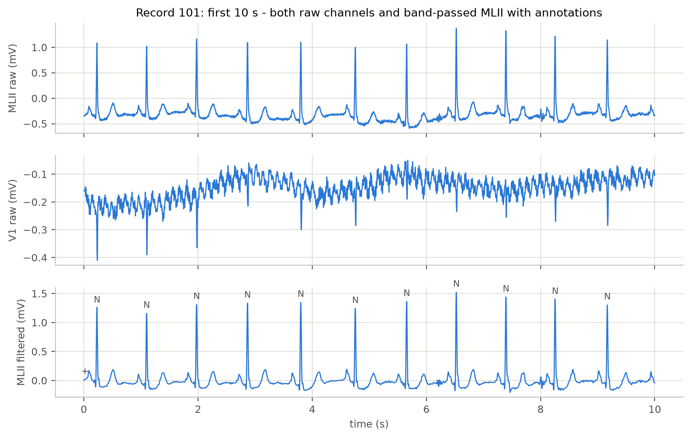
*Figure 1: First 10 s of record 101: raw MLII, raw V1, and MLII after the 0.5-40 Hz band-pass with the reference annotations.*

Every beat in MLII shows a P wave, a tall narrow QRS complex and a T wave. V1 carries the same beats with inverted
polarity and a QRS about ten times smaller (0.17 mV against 1.73 mV peak-to-peak), so the same noise disturbs it far
more. The raw MLII trace lies 0.3-0.5 mV below zero and drifts slowly; after filtering it is centred on zero and the
drift is gone, while the QRS shape is unchanged. The annotations coincide with the R-peaks.

**Example heartbeat from each class**

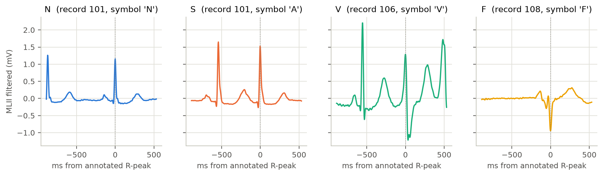
*Figure 2: The first beat of each class in DS1, shown in the 512-sample beat window (filtered MLII). Dotted line: annotated R-peak. The F example is not typical of its class, see the text.*

The N and S examples come from the same record and their QRS complexes are almost identical. What differs is the timing:
the previous R-peak lies 869 ms before the N beat but only 539 ms before the S beat. The V example has a wide QRS with a
deep negative deflection and no distinct P wave before it. S is therefore recognized mainly from the part of the window
before the beat, V from the QRS complex itself. The F example comes from record 108, which has only two F beats, and is
not typical of the class (Figure 3).

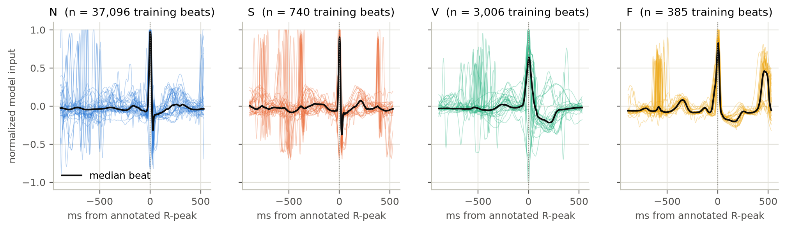
*Figure 3: 30 random training beats per class after normalization (the prepared beat window), with the median beat of the class.*

The N beats differ widely in what surrounds the QRS, because they come from 18 patients with different heart rates. The
F traces are almost identical, including a large wave about 460 ms after the beat: 372 of the 385 training F beats come
from record 208, where 78 % of the F beats are followed by a V beat after a median of 458 ms. A model can therefore
separate F in the training data by this patient's rhythm instead of by the fusion morphology. Many N and S traces are
flat at 1.0 at the R-peak: the clip at 5 standard deviations cuts the peak in 49 % of the N windows and 29 % of the
S windows, but in only 4 % of the V windows (section 3.4).

**Class distribution**

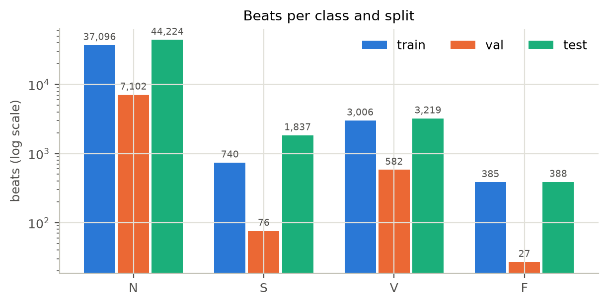
*Figure 4: Beats per class and split (log scale). Record 201, which is excluded from training and validation (section 2.5), is not shown.*

N makes up 89.5 % of all beats, V 7.0 %, S 2.8 % and F 0.8 %: 112 N beats for every F beat. A classifier that always
answers N reaches about 89 % accuracy, so accuracy cannot be the main metric. The class shares also differ between the
splits: S is 1.8 % of the training beats but 3.7 % of the test beats, and the validation split has only 27 F beats.

**Subject/record distribution**

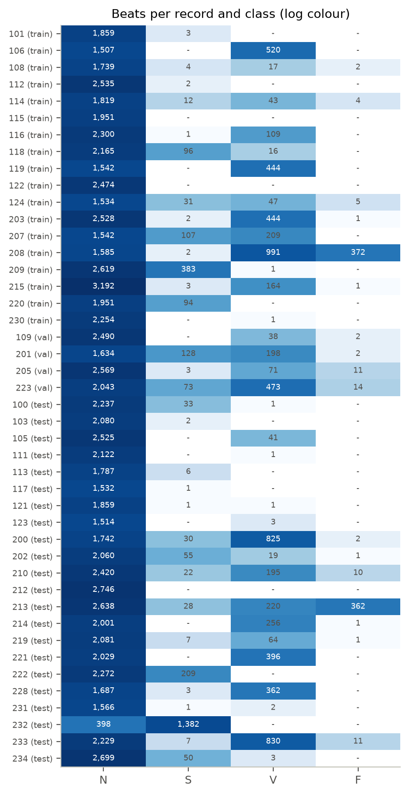
*Figure 5: Beats per record and class.*

Every record contains N beats, but S occurs in 32, V in 33 and F in 17 of the 44 records, and the minority classes are
concentrated in a few of them. Record 208 holds 97 % of the training F beats and record 209 holds 52 % of the training
S beats; in the test set record 213 holds 93 % of the F beats and record 232 holds 75 % of the S beats. The number of
patients behind a minority class is far smaller than its number of beats suggests, and the per-class results will
largely reflect single patients.

**Signal amplitude distribution**

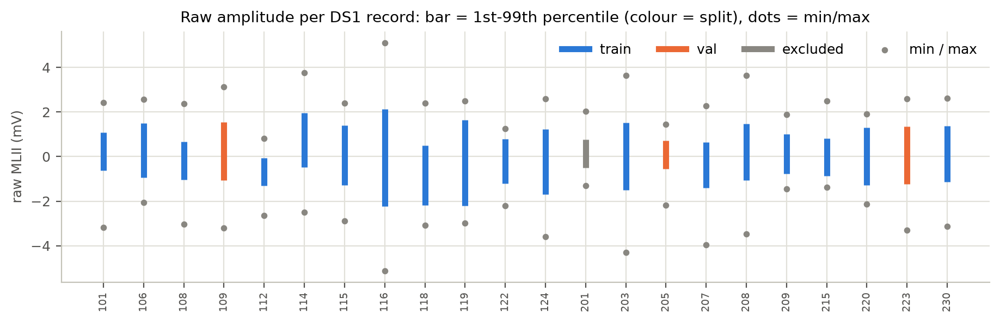
*Figure 6: Raw MLII amplitude per DS1 record: 1st-99th percentile (bar) and extremes (dots).*

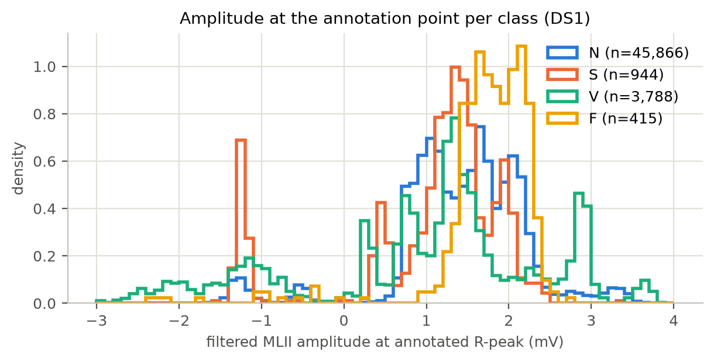
*Figure 7: Filtered MLII amplitude at the annotated R-peak per class (DS1).*

Amplitude differs more than threefold between DS1 records (standard deviation 0.19 mV in record 201, 0.66 mV in record
116), and so does the baseline level: record 112 lies almost entirely below 0 mV. Record 116 reaches the ADC limits at
+-5.12 mV (section 2.4). At the R-peak the four class distributions overlap almost completely. The class medians lie
within 0.6 mV of each other (1.26-1.82 mV), while the median of the N beats alone ranges from -1.27 to 3.02 mV between
records, and the separate peaks in Figure 7 are single records: the S peak at -1.2 mV is record 207, the V peak at
2.9 mV is record 119. Within a record the S median follows the N median closely (1.57 and 1.53 mV in record 101,
-1.24 and -1.27 mV in record 207). Absolute amplitude identifies the patient, not the class, which is why it is removed
by per-window normalization (section 3.4).

**Examples of noisy ECG**

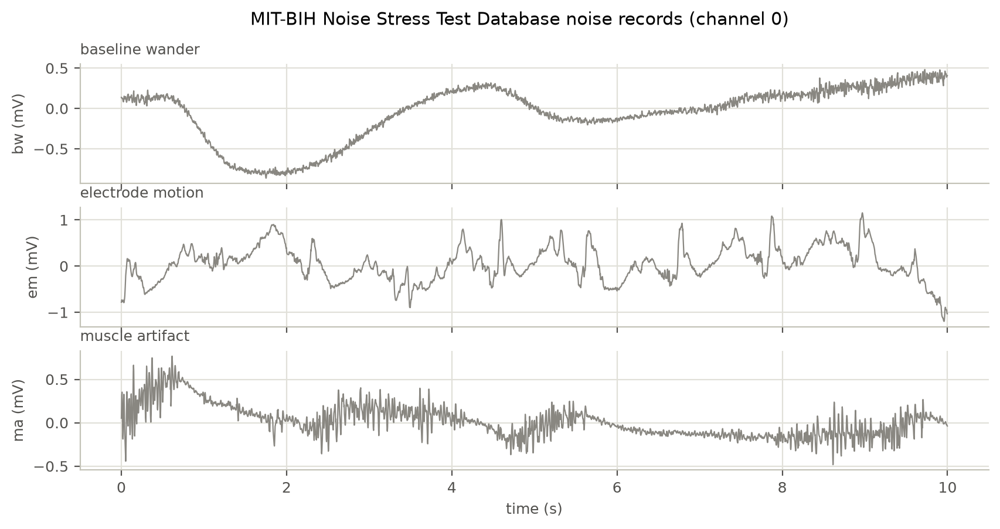
*Figure 8: 10 s of the three Noise Stress Test Database records: baseline wander (bw), electrode motion (em), muscle artifact (ma).*

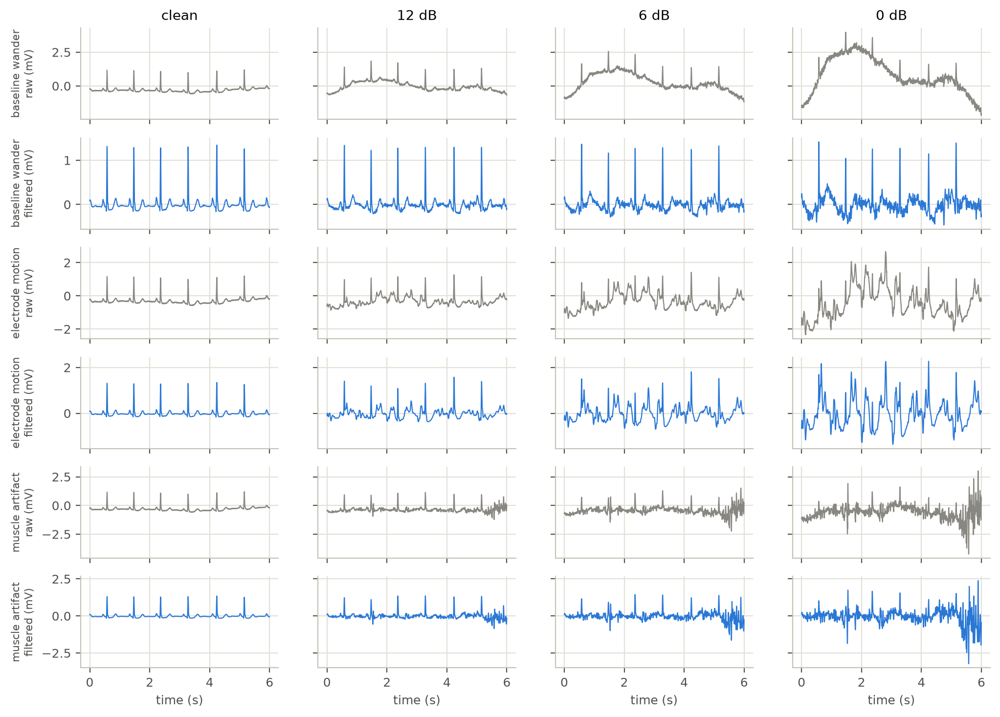
*Figure 9: Record 101 with each of the three noise types at 12, 6 and 0 dB. For every noise type the upper row is the raw signal and the lower row the signal after the band-pass filter. The same stretch of noise is used at every SNR.*

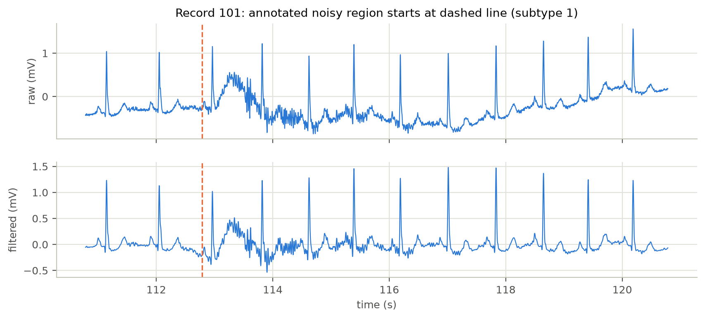
*Figure 10: A stretch of record 101 that the annotators marked as noisy, raw and filtered.*

SNR is defined as in the `nst` tool that produced the database: the signal power is the squared peak-to-peak QRS
amplitude divided by 8, the noise power the squared RMS noise amplitude in one-second windows (`src/noise.py`). The
scaling was checked against the twelve noisy records the database provides (118e24 to 119e_6): the gains agree within
0.05 dB.

The three noise types differ in how much of their power lies in the 0.5-40 Hz band that the filter passes: 1 % for
baseline wander, 16 % for muscle artifact and 58 % for electrode motion. Figure 9 shows the consequence for record 101,
whose QRS complexes measure 1.73 mV peak to peak. At 0 dB the added baseline wander has an RMS amplitude of 2.85 mV, of
which 0.34 mV remains after the filter; of the muscle artifact 0.55 of 1.37 mV remains, of the electrode motion 1.02 of
1.35 mV. Baseline wander is therefore mostly removed, although its fastest swings pass the filter and are locally as
large as a QRS complex at 0 dB. Muscle artifact leaves bursts of fast oscillation between and on top of the beats.
Electrode motion is hardly reduced, and its deflections have the width and amplitude of QRS complexes and ectopic
beats: at 12 dB it distorts the baseline, at 6 dB beats and noise are hard to tell apart by eye, and at 0 dB the noise
deflections are larger than the QRS complexes. Figure 10 shows that such noise also occurs naturally in the recordings:
a burst of muscle noise whose in-band part survives the filter.

**Signal measures and features**

To examine the signals more broadly, 79 measures in eight families were computed for each of the 50,976 DS1 beats
(`src/features.py`), on the filtered MLII signal in a 256-sample segment from -278 to +433 ms around the R-peak unless
the measure says otherwise.

| Family | Measures | Examples |
|---|---|---|
| Amplitude statistics | 14 | mean, standard deviation, RMS, peak-to-peak, skewness, kurtosis, crest factor, energy |
| Shape and complexity | 10 | zero crossings, line length, Hjorth mobility and complexity, Teager energy, permutation entropy |
| QRS morphology | 16 | R amplitude, QRS width, area and slopes, Q and S depth, T and P deflection, ST level |
| Rhythm | 13 | previous and next RR interval, ratios of the previous interval to short and long estimates of the patient's rhythm, heart rate, RR variability |
| Frequency | 10 | power in 0.5-5, 5-15 and 15-40 Hz, spectral centroid, median frequency, spectral entropy |
| Wavelet | 5 | Haar energy share per decomposition level |
| Patient-relative | 6 | correlation with the record's median beat or the previous beat, QRS width relative to the record median |
| Prepared window | 5 | standard deviation, largest z-score and clipped share of the normalized 512-sample beat window |

For every measure and every minority class, separability from N is the area under the ROC curve of that measure alone
(0.5 = none, 1.0 = complete). It is computed with all DS1 beats pooled, and within each record that has at least 10
beats of both classes (median over 8 records for S, 15 for V and 3 for F). The complete table is
`results/data_stats/feature_separability.csv`.

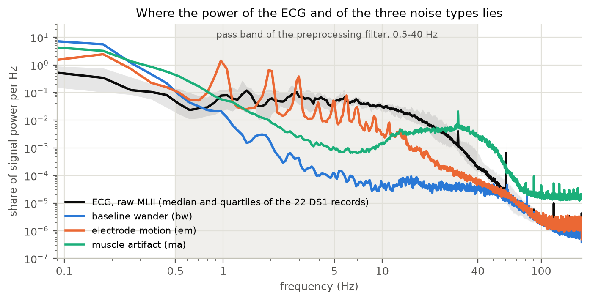
*Figure 11: Power spectral density of the raw ECG and of the three noise types, each scaled to unit power.*

90.6 % of the raw ECG power lies in the 0.5-40 Hz pass band, 8.2 % below it (baseline drift) and 0.3 % above it, where
the 60 Hz power-line peak stands 9 times above its surroundings. Baseline wander lies almost entirely below the band.
Electrode motion peaks between 1 and 10 Hz, where the ECG has most of its power, so a fixed band-pass cannot remove it.

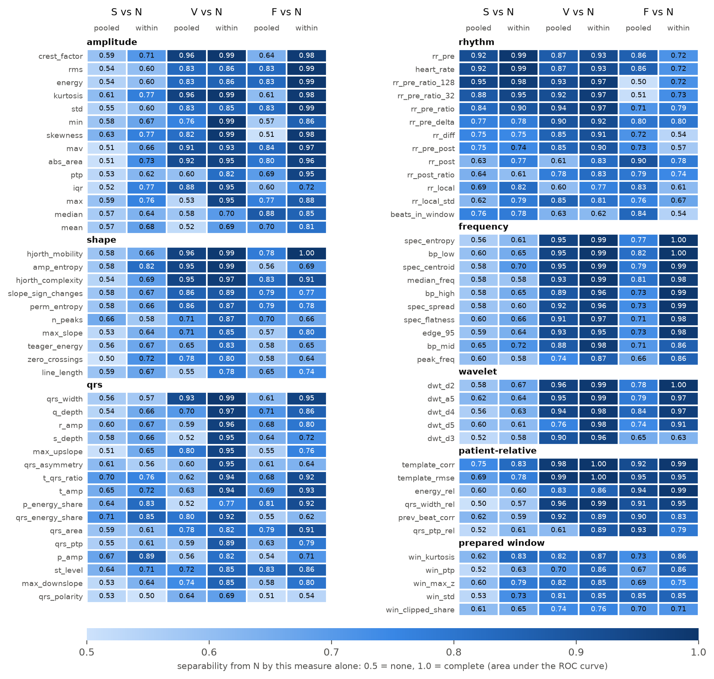
*Figure 12: Separability of S, V and F from N for every measure, pooled over DS1 and within records.*

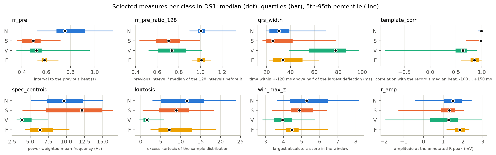
*Figure 13: Distribution per class of eight selected measures.*

The classes differ in the kind of measure that separates them:

- **S is separated by rhythm.** The previous RR interval reaches 0.92 pooled and 0.99 within records (median 0.49 s for
  S against 0.76 s for N). The best measure outside the rhythm family reaches 0.75 (correlation with the record's median
  beat), and no amplitude, shape, spectral or wavelet measure exceeds 0.66. The absolute interval is confounded with the
  patient's heart rate: in record 215 (112 bpm) 95 % of the normal beats have a previous RR below 0.6 s. Dividing by the
  median of the 128 intervals before it removes this and reaches 0.95 pooled. A short reference does less for S (0.84
  with the mean of the last 10 intervals), because S beats often come in runs that pull the reference along; for V,
  whose beats are mostly isolated, the short reference is the better one (0.94 against 0.88 for the absolute interval).
- **V is separated by morphology.** Correlation with the record's median beat (0.98 pooled), QRS width (0.93; median
  78 ms against 31 ms), kurtosis and the spectral measures (0.95-0.96) all work, because the wide QRS moves power to low
  frequencies (spectral centroid 3.8 Hz against 9.7 Hz).
- **F lies between N and V** on these measures (correlation with the median beat 0.99 for N, 0.86 for F, 0.63 for V) and
  is separated best by the patient-relative family (0.90-0.95 pooled).

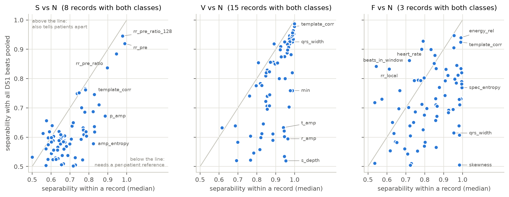
*Figure 14: Separability within a record against separability with all beats pooled; one dot per measure.*

Figure 14 compares the two views. Measures on the line work the same way in every patient. Measures far below it
separate the classes inside each patient but not across patients: the R-peak amplitude separates V from N with 0.96
within records but 0.59 pooled, because the direction of the difference changes between patients (it agrees in 67 % of
the records). Such information is usable only relative to the patient's own beats. Measures above the line owe part of
their pooled value to which patients have the class: for F, heart rate (0.86 pooled, 0.72 within) and the number of
beats in the window (0.84 against 0.54) look informative mainly because record 208, which holds most F beats, has a fast
rhythm (104 bpm). The patient-relative family stays closest to the line for V and F. It includes the correlation with
the previous beat (0.92 for V, 0.90 for F pooled), which needs nothing but the preceding beat, and that beat lies inside
the 512-sample beat window for 92 % of the V and 97 % of the F beats.

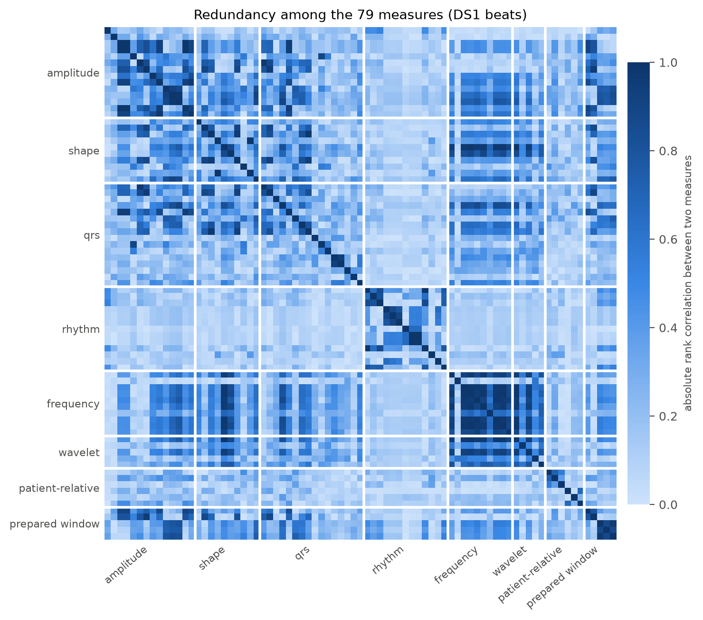
*Figure 15: Absolute rank correlation between the 79 measures.*

Many measures are redundant: 73 pairs correlate above 0.9, and 54 measures remain when one of each such pair is dropped.
The frequency and wavelet families and the Hjorth mobility form one block that measures the same thing, the frequency
content of the beat. The rhythm family is nearly uncorrelated with all others and carries independent information.

The measures are candidate inputs for a classifier; whether the model works on such measures, on the beat window
itself, or on both is decided in the modelling stage. In every case they show what has to be extracted from the signal:
timing for S, QRS shape for V, and a comparison with the patient's own normal beat for F. Two limits apply before they
are used as inputs. Five of the patient-relative measures are computed from all beats of a record and four rhythm
measures need the next beat, so a device that classifies in real time needs causal versions of them (a running
template, a delayed decision). And all values are separabilities of single measures on 22 patients; the F values
within records rest on three records.

**What matters most for the following stages**

Three findings carry over, in this order of importance.

1. **The patient, not the beat, limits what can be learned.** The minority classes come from very few patients
   (Figure 5), amplitude and most morphology measures differ more between patients than between classes (Figures 7 and
   14), and S and F are defined relative to the patient's own rhythm and normal beat. A model must therefore be judged
   on records it has not seen, the F class cannot be expected to generalize from essentially one training patient, and
   information relative to the patient (the preceding beat, RR ratios) is worth more than absolute values.
2. **Timing separates S, shape separates V** (Figures 2 and 12). Whatever the model is, its input has to carry the
   preceding RR interval, inside the window or as an explicit measure.
3. **Electrode-motion noise lies in the ECG band** (Figures 9 and 11) and cannot be filtered away. Robustness against
   it has to come from the model, or be stated as a limit.

### 2.4 Data Quality
Data quality was examined on the 22 DS1 records (`results/data_stats/data_quality.csv`, notebook section 2.4). Nothing
was removed from the data as a result; the reason is given for each item.

**Missing data.** Every record has 650,000 samples on both channels. MLII contains no missing values and no second
without signal variation. What is missing is of another kind. Nine stretches of more than 3 s carry no beat annotation,
163 s in total, of which 152 s are in record 207: its episodes of ventricular flutter are annotated as flutter waves,
not as beats, so they produce no beat windows. And the F class is all but missing from most records (section 2.3).

**Extreme amplitudes.** The raw signal is limited to +-5.12 mV by the ADC, and the range differs between records by a
factor of three (Figure 6). The peak-to-peak range of a filtered beat window has a median of 2.20 mV and a maximum of
6.24 mV. Only 64 of the 50,976 windows exceed 5 mV, 40 of them in record 116, which has the largest beats of DS1, 13 in
record 203 and 10 in record 109. Large amplitude is therefore mostly a property of the patient and not an error. It is
kept, and the per-window normalization takes it out (section 3.4).

**Corrupted segments.** Only record 116 reaches the ADC limits: 928 samples in three episodes around 1002, 1391 and
1404 s, the longest lasting 0.74 s (Figure 16). The signal jumps to a limit and drifts back while the beats continue,
which looks like an electrode or amplifier transient. Ten beat windows contain saturated samples, all of class N. The
annotators also marked 66 isolated QRS-like artifacts; 115 beat windows (0.23 %) contain one, 48 of them in record 203.
These windows are kept: they are too few to change any result, and a device will meet such transients too.

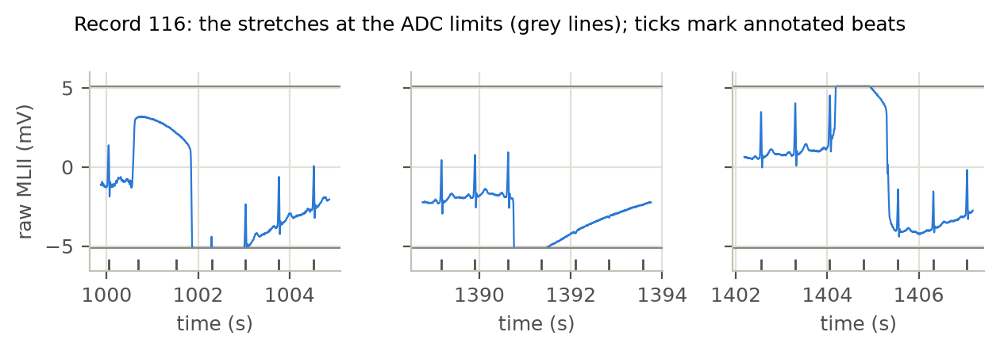
*Figure 16: The three stretches of record 116 that reach the ADC limits (grey lines). Ticks mark the annotated beats.*

**Possible noisy regions.** According to the annotators' signal-quality marks, MLII is noisy for 620 s (1.56 % of DS1)
and unreadable for 5.3 s. 886 beats (1.74 %) lie in the noisy stretches and none in the unreadable ones. The noise is
concentrated in a few records: 203 (227 s, 389 beats), 108 (196 s, 207 beats), 208 (63 s, 105 beats) and 207 (41 s,
55 beats). A measure that does not depend on the annotators agrees for record 108: its baseline-wander power is 1.9
times its power in the ECG band, against less than 0.5 in every other record, while the power above 40 Hz stays below
1 % of the ECG-band power everywhere (Figure 17). Beats in noisy stretches are kept. Their labels were still assigned by
the cardiologists, and a model that has never seen noisy beats would be unprepared for the robustness test.

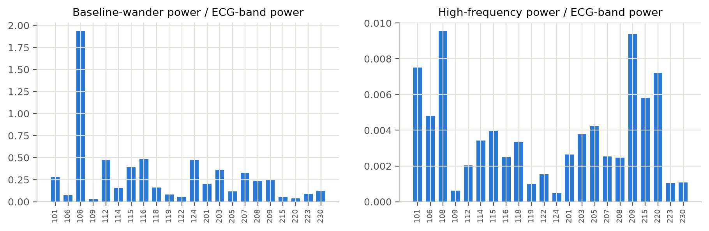
*Figure 17: Baseline-wander power (below 0.5 Hz) and high-frequency power (above 40 Hz) relative to the power in the ECG band, per DS1 record.*

**Class imbalance.** In DS1, N makes up 89.9 % of the beats (45,832), V 7.4 % (3,786), S 1.9 % (944) and F 0.8 %
(414). The imbalance between patients is stronger than the imbalance between beats: one record holds 90 % of the F
beats and one holds 41 % of the S beats (Figure 5). How this is handled in training is decided in section 3.6.

**Differences between recordings.** The records differ in heart rate (median 53 bpm in record 124, 112 bpm in record
215), in amplitude (standard deviation 0.19 to 0.66 mV), in noise level (above) and, most importantly, in what a normal
beat looks like. In four records the N class consists entirely of bundle branch block beats: left in record 109, right
in records 118 and 124, both in record 207. These beats have a wide QRS, the property that marks V beats in other
patients, and in record 207 the QRS is inverted (median R-peak amplitude -1.27 mV). Figure 18 shows how much the median
N beat varies between the training records. A model has to cope with a patient-specific normal beat, which is one more
reason to evaluate by record. Record 109 is one of the three validation records.

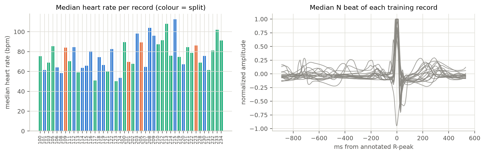
*Figure 18: Median heart rate per DS1 record (left) and the median N beat of each training record after normalization (right).*

**Differences between ECG channels.** The second channel is V1 in 38 of the 44 used records and V2, V4 or V5 in the
others. The two channels of a record are not interchangeable: after filtering, their correlation in DS1 ranges from
-0.83 to +0.75. Record 114 stores MLII on the second channel instead of the first (Figure 19). Only MLII is used, and
it is selected by name (section 3.2).

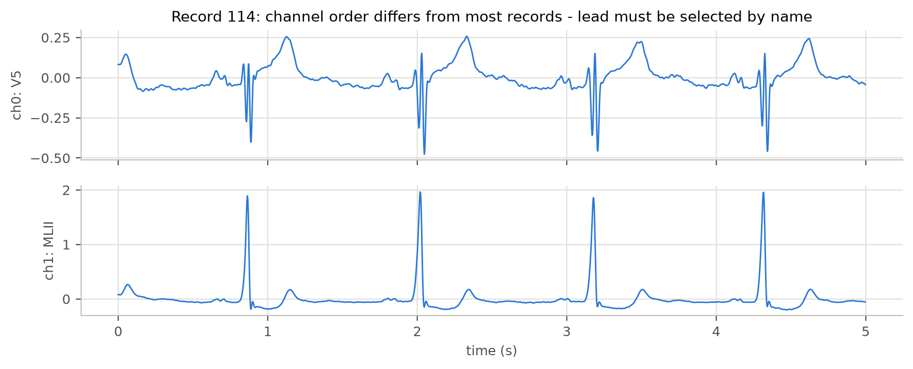
*Figure 19: The two channels of record 114, where MLII is stored second.*

**Consistency and labels.** All 22 records have the same sampling frequency (360 Hz), length, ADC resolution (11 bit)
and gain (200 units per mV), so no record needs resampling or rescaling. The beat labels are the reference annotations
of the database, assigned independently by two cardiologists per record with disagreements resolved by consensus (Moody and Mark,
database directory).
They are used as ground truth and were not checked individually.

The records that stand out are summarized below.

| Record | Split | What stands out |
|---|---|---|
| 108 | train | 196 s marked noisy; strongest baseline wander |
| 109 | validation | every N-class beat is a left bundle branch block beat |
| 116 | train | three episodes at the ADC limits; largest amplitude |
| 118, 124 | train | every N-class beat is a right bundle branch block beat |
| 203 | train | 227 s marked noisy; 26 of the 66 artifact marks |
| 207 | train | N class is bundle branch block with inverted QRS; 152 s of flutter without beat annotations |
| 208 | train | 90 % of the F beats of DS1; 63 s marked noisy |
| 201 | excluded | same subject as DS2 record 202 (section 2.5) |
| 215 | train | fastest rhythm (112 bpm) |

### 2.5 Leakage Analysis
Data leakage means that information about the test data reaches the model, or the choices made while building it, so
that the test result overstates how the model will perform on new patients.

**Why a random split of heartbeats is misleading.** Two properties of the data make a beat-level split leak (notebook
section 2.5, DS1 only).

1. *Beat windows share samples.* The window is 512 samples long and most RR intervals are much shorter, so 99.5 % of
   the windows overlap the window of the next beat, by a median of 246 samples (48 % of the window). Of all ECG samples
   that lie in a beat window, 73 % lie in two or more. A random split would put the same pieces of signal into the
   training and the test data.
2. *Beats of one patient resemble each other more than beats of one class.* For 98.3 % of the DS1 beats the most
   similar other beat comes from the same record, a median of 185 s away, so this is not an effect of the overlap.
   Figure 20 shows the consequence. If the class of a beat is simply looked up from its most similar beat, the answer is
   right for 83 % of the S beats and 80 % of the F beats when beats of the same record may be used, and for 23 % and 1 %
   when they may not. The macro F1 of this lookup is 0.91 in the first case and 0.45 in the second.

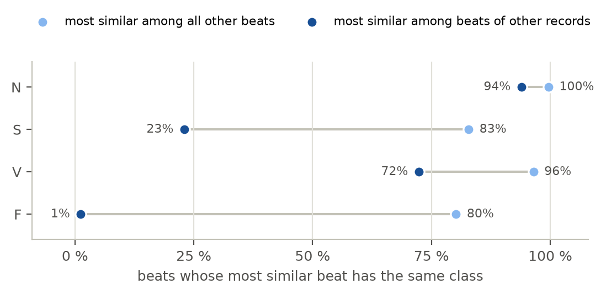
*Figure 20: Share of DS1 beats whose most similar beat has the same class, when that beat is searched among all other beats and among the beats of other records only.*

With a random split a model therefore does not have to learn what an S or an F beat is. Recognizing the patient is
enough, and the reported performance says nothing about patients it has not seen. This agrees with the rest of the
data understanding: the minority classes are concentrated in a few patients (Figure 5), and most measures separate the
classes better within a patient than across patients (Figure 14).

**Routes for leakage and how each is closed.**

| Route | How it could happen here | What prevents it | How strong |
|---|---|---|---|
| Beats of one record in two splits | random split of beats | DS1 and DS2 are disjoint sets of records (inter-patient partition of de Chazal et al.); the validation records are whole DS1 records | enforced: `config.split_records()` stops if a record is shared or a validation record is not in DS1 |
| Statistics computed across splits | normalization constants or filter settings estimated on all data | the filter is applied per record and the z-score per window; no statistic is shared between records | by design; if measures are scaled for a classifier, the scaling must be fitted on training records only |
| Choices made with test data | model selection, early stopping, thresholds or hyperparameters tuned on DS2 | `evaluate.py` and `noise_test.py` refuse DS2 unless `--final` is given | a guard against accidents; `test.npz` is on disk from the first run, so it rests on discipline |
| Design decisions from looking at test data | exploring DS2 signals | the notebook analyses DS1 signals only; DS2 enters through record headers and class counts | by procedure; `record_stats.csv` contains DS2 amplitude statistics written by the pipeline, which were not inspected |
| Noise | the same noise segment in training augmentation and in the robustness test | each noise record is split in time: first half for augmentation, second half for evaluation | enforced in `src/noise.py` |
| One person in two splits | records 201 (DS1) and 202 (DS2) come from the same subject | record 201 is excluded from training, validation and model selection (`splits.exclude` in `configs/data.yaml`) | enforced: `config.split_records()` keeps excluded records out of the training and validation lists |

**What remains.**

- *Record 201 in the data understanding.* The partition named in the project description lists record 201 in DS1
  and record 202 in DS2, although both come from one subject (record 202 holds 2,135 of the 49,668 DS2 beats). To
  keep training and testing patient-independent, record 201 is not used for training, validation or model selection;
  DS2 is left as specified. Record 201 is still one of the 22 records described in sections 2.2 to 2.4, where no
  conclusion rests on it alone.
- *A much-used test set.* DS2 has been the test set of many published studies, so methods taken from the literature
  are already adapted to it to some degree. This cannot be removed, only stated.
- *Conditions better than on a device.* The beat positions of the test records come from the annotations, and the
  zero-phase filter uses future samples. Neither reveals a label, but both make the test easier than real use
  (sections 3.3 and 3.4).

## 3. Data Preparation

### 3.1 Record Selection *(generated: `split_summary.csv`, `cv_folds.csv`)*
The 48 records of the database are used as follows. Every split is made by record, never by beat.

| Use | Records | Number |
|---|---|---|
| Development, training | 101, 106, 108, 112, 114, 115, 116, 118, 119, 122, 124, 203, 207, 208, 209, 215, 220, 230 | 18 |
| Development, validation | 109, 205, 223 | 3 |
| Excluded from development | 201 (same subject as test record 202, section 2.5) | 1 |
| Test (DS2) | 100, 103, 105, 111, 113, 117, 121, 123, 200, 202, 210, 212, 213, 214, 219, 221, 222, 228, 231, 232, 233, 234 | 22 |
| Not used | 102, 104, 107, 217 (paced beats, section 2.2) | 4 |

Development and test follow the inter-patient partition of de Chazal et al. (DS1 and DS2) given in the project
description, with the one exclusion explained in section 2.5.

**How the records are used.**

- *Model selection.* Every choice between alternatives (kind of model, inputs, hyperparameters, imbalance strategy,
  number of training epochs) is made with leave-one-record-out cross-validation over the 21 development records. Each
  record is held out once and predicted by a model trained on the other 20. The predictions of all 21 records are
  pooled and the metrics are computed once on the pooled 49,014 beats. All folds use the same settings and a fixed
  number of epochs, so nothing is tuned on the record that is held out. Neural models are trained with three random
  seeds per configuration, and a difference smaller than the spread between the seeds is not treated as evidence.
  The folds and their class counts are listed in `results/data_stats/cv_folds.csv`.
- *Final model.* The selected configuration is trained on the 18 training records. The 3 validation records monitor
  that training run; they are not used to choose between models.
- *Test.* DS2 is evaluated once, after the configuration is frozen.

**Why cross-validation instead of a fixed validation set.** The patient is the unit that limits learning (section
2.3), and the minority beats sit in a few records. The three validation records contain 76 S and 27 F beats, so a
comparison of two models on them would be decided by a few dozen beats from two or three patients. With
cross-validation every development beat is predicted by a model that has not seen its record: 816 S, 3,588 V and
412 F beats from 21 patients.

Two properties of this design have to be kept in mind. A single fold cannot be scored on its own, because 12 of the
21 records contain no F beat and 6 contain no S beat; that is why the predictions are pooled. And when record 208 is
held out, only 40 F beats remain for training, so the cross-validated result for F mostly measures how well F is
recognized in a patient the model has hardly any examples for. The cost is 21 training runs per configuration.

### 3.2 ECG Channel Selection
**Lead used.** One channel, the modified limb lead II (MLII). It is selected by its name in the record header, not by
its position in the file.

**Why this lead.**

- *It is the only lead that all used records share.* All 44 DS1 and DS2 records contain MLII. The second channel is V1
  in 38 of them, V5 in 3, V2 in 2 and V4 in 1, and the two channels of a record are not interchangeable: their
  correlation in DS1 ranges from -0.83 to +0.75 (section 2.4). A model that used the second channel would receive
  different leads for different patients.
- *It has the larger QRS complex.* In 21 of the 22 DS1 records the QRS is larger in MLII than in the other channel
  (median peak-to-peak amplitude 2.02 mV against 0.86 mV; the exception is record 108). The same noise therefore
  disturbs MLII less (Figure 1). The database directory makes the same observation: normal QRS complexes are usually
  prominent in the upper signal, MLII, and often hard to discern in the lower one (Moody and Mark, database directory).
- *It fits the application.* The intended use is a single-lead wearable monitor, and one channel keeps the input
  small: 512 values per beat for the MAX78002. Heartbeat classification from the single lead II of this database, with
  the same inter-patient partition and with wearable devices in mind, has been published (Alfaras et al., 2019).

**Channel position.** MLII is the first channel in every used record except record 114, where it is the second
(Figure 19). Selecting channel 0 would silently feed V5 for that record, which is why the lead is selected by name.

**If the lead is not available.** `load_record()` stops with an error that names the record and the leads it has; it
never substitutes another lead, because a different lead is a different signal. This does not occur in the 44 used
records: the only records of the database without MLII are 102 and 104, which are paced records and not used (section
2.2). On a device the electrode placement fixes the lead; a placement other than MLII would be a shift in the data that
this project does not cover.

**What is given up.** The second channel is discarded although it carries additional information; de Chazal et al.
used both leads. This is accepted for the three reasons above and is a limitation of the project.

### 3.3 Beat Extraction
**Where a beat is.** The position of a beat is the sample index of its reference annotation in the `atr` file of the
record. No QRS detector is used. According to the database directory, the beat labels were first produced by a
slope-sensitive QRS detector, corrected independently by two cardiologists, and later moved to the major local extremum
of the QRS complex, so that they "generally appear at the R-wave peak" (Moody and Mark, database directory). A check on
DS1 agrees: the annotation lies within one sample (2.8 ms) of the largest deflection of the filtered signal for 89.0 %
of the beats and within three samples (8.3 ms) for 96.5 %. The marked point is not always a positive peak; for beats
with an inverted QRS it is the negative one (Figure 7).

This is an assumption of the whole project: the classifier is given correct beat positions. A device has to find the
beats itself with a QRS detector, which will miss some beats and place others less exactly. The project therefore
measures classification, not detection, and a shift of the window by a few samples is part of the training
augmentation (section 3.7).

**The window.** For every beat the window consists of 320 samples before the annotation and 192 samples after it:
512 samples, or 1.42 s (from -889 ms to +533 ms) at 360 Hz. Every beat gives a window of exactly this size; nothing is
resampled or padded. These numbers come from the initial configuration of the project (decision log, 2026-09-15), where
they were chosen so that the window would usually contain the previous R-peak and add up to 512. They were not compared
with alternatives, so they are starting values, not results.

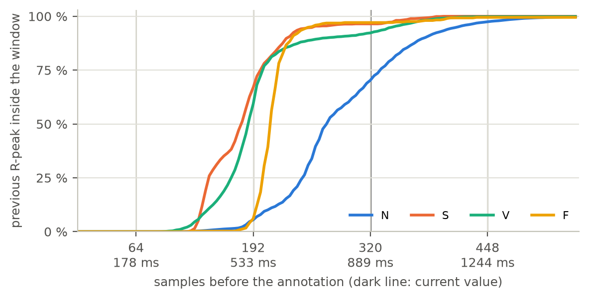
*Figure 21: Share of DS1 beats whose previous R-peak lies inside the window, as a function of the number of samples before the annotation. Dark line: the current value of 320.*

- *Before the beat.* S is separated from N by timing (section 2.3), so the window has to show the preceding beat.
  Figure 21 shows what a given length achieves. With 64 samples the window never contains the previous R-peak. With
  192 samples it does for 67 % of the S and 59 % of the V beats, with 320 for 96.5 % of the S, 92.3 % of the V, 97.1 %
  of the F and 70.3 % of the N beats, and with 448 for at least 97.5 % of every class. The data support a long window
  before the beat but do not single out 320. The length before the beat is therefore treated as a parameter: 64, 192,
  320 and 448 samples, each with 192 samples after the beat, will be compared by cross-validation in the modelling
  stage (section 3.1).
- *After the beat.* 192 samples (533 ms) cover the T wave of the beat, and they set the delay: a beat can be classified
  at the earliest 0.53 s after its R-peak. The next R-peak lies inside the window for 10.6 % of the beats. This length
  is kept fixed.
- *In total.* The MAX78002 accelerator needs a fixed input size. All four candidates give a length that is a multiple
  of 64 (256, 384, 512 and 640 samples), which pooling layers can halve repeatedly.

A window of this length cannot show the patient's rhythm over the last minute, which the long RR ratio of section 2.3
needs. The previous, next and local RR intervals of every beat are therefore stored next to its window. They are
computed from all annotated QRS complexes, including beats of excluded types, so that an excluded beat does not create
a falsely long interval. Whether RR values or other measures are given to the model in addition to the window is left
open until the modelling stage.

**What a window contains.** 64 % of the DS1 windows contain two annotated beats (the beat itself and one neighbour),
26 % only the beat itself and 10 % three or more. Consecutive windows overlap, by a median of 48 % (section 2.5), which
is one reason why all splits are made by record.

**Beats at the edges of a record.** A beat whose window would reach beyond the start or the end of the record is
dropped: 74 beats in the 44 records (0 to 3 per record), 37 of them in DS1 (34 N, 2 V, 1 F). Padding the window
instead would add samples that are not ECG.

### 3.4 Signal Preprocessing
The operations are applied in this order (`src/prepare_data.py`, parameters in `configs/data.yaml`):

1. Raw MLII signal of the whole record in mV.
2. Band-pass filter 0.5-40 Hz over the whole record: a Butterworth filter designed with `order: 4`, which gives an
   8th-order band-pass, applied forward and backward (`scipy.signal.sosfiltfilt`). The result has zero phase shift and
   an attenuation of 6 dB at the two band edges.
3. Segmentation into beat windows (section 3.3).
4. Per-window z-score: the mean of the window is subtracted and the result divided by the standard deviation of the
   window.
5. Clipping to +-5 standard deviations.
6. Division by 5, which gives values in [-1, 1], stored as 32-bit floats of shape (1, 512).

All parameter values come from the initial configuration (decision log, 2026-09-15) and are starting values. For each
step the following paragraphs give the reason, the evidence from DS1 (notebook, "Evidence for the data preparation")
and the cost.

**Band-pass filter.** The filter removes what is not the heartbeat. Below 0.5 Hz lies the baseline drift: 8.2 % of the
raw signal power, in record 108 more than the power of the ECG band itself (Figure 17), together with offsets that
differ between records (Figure 6). Above 40 Hz lies 0.3 % of the power, including the 60 Hz power-line peak, and
part of the muscle noise. 90.6 % of the raw power lies inside the band (Figure 11). The cost is small: the
peak-to-peak amplitude of the QRS complex falls by 3 % in the median (between 7 % less and 2 % more over the DS1
records), and the lower band edge stays below the slowest median heart rate of DS1 (53 bpm, 0.89 Hz), so the
fundamental frequency of the rhythm passes. The filter cannot remove electrode-motion noise, 58 % of which lies inside
the band (section 2.3).

The zero-phase form keeps every wave where it is relative to the annotation, but it uses future samples. It can
therefore only be applied to a stored record. A device needs a causal filter, which delays the signal and shifts the
waves relative to each other. The zero-phase filter is kept for the prepared data: a causal filter removes no
additional noise and changes the shape of the waves, so it cannot be expected to improve the classification. The
difference between the prepared data and a device is a limitation of the project, and what the causal filter costs
is examined in the deployment stage.

**Filtering before segmentation.** The filter is applied to the whole record and the windows are cut afterwards. The
other order gives a different signal: when each 512-sample window is filtered on its own, the result deviates from
the whole-record result by 0.21 standard deviations of the window in the median, and by more than 1.35 in 5 % of the
windows. A window of 1.42 s is too short for a filter whose lower edge has a period of 2 s. Filtering the whole record
also corresponds to a device, where the filter runs continuously.

**Per-window z-score.** Amplitude and offset differ more between patients than between classes (Figures 6 and 7): the
standard deviation of a beat window ranges from 0.16 to 0.56 mV (5th to 95th percentile). The z-score removes this
difference. It uses only the window itself, so no statistic is shared between records (section 2.5) and nothing has to
be stored on a device. The cost is that the absolute amplitude is discarded, and that the divisor depends on what else
is in the window. For N beats the largest value reaches a median of 7.1 standard deviations when the window contains
only that beat, 4.9 when it contains two beats and 4.2 with three or more. The normalized height of a beat therefore
depends on the heart rate, and by the same mechanism strong noise in a window lowers it.

**Clipping and scaling.** The MAX78002 takes signed 8-bit inputs, so the values must lie in a fixed range, and
[-1, 1] maps onto it. A z-score has no upper limit, so a limit has to be set, and the clip level sets it. The largest
value in a window has a median of 5.10 standard deviations, a 99th percentile of 8.66 and a maximum of 9.54. At the
current level of 5, 52 % of the windows have at least one clipped sample: 56 % of the N, 44 % of the S, 21 % of the
F and 11 % of the V windows. Narrow beats lose the top of their R-peak, wide beats mostly do not, and the windows with
a single beat are hit most. A higher level keeps the peak but makes the 8-bit representation coarser, because one
8-bit step equals the clip level divided by 128:

| Clip level | Windows with a clipped sample | One 8-bit step |
|---|---|---|
| 5 (current) | 52 % | 0.039 standard deviations |
| 6 | 30 % | 0.047 |
| 8 | 6 % | 0.062 |
| 10 | 0 % | 0.078 |

The choice trades the shape of the R-peak against the resolution of the small waves after quantization, and the data
alone cannot settle it. The clip level is therefore treated as a parameter: 5, 8 and 10 will be compared by
cross-validation in the modelling stage, including the quantized model.

**What is not done.** The signal is not resampled; 360 Hz is the rate of every record. No notch filter is used, since
60 Hz lies above the upper band edge. Noisy stretches are not removed (section 2.4).

| Step | Parameter | Value | Status |
|---|---|---|---|
| Band-pass | band edges | 0.5 and 40 Hz | fixed, supported by the spectrum (Figure 11) |
| Band-pass | form | zero-phase, whole record | used for the prepared data; `zero_phase: false` in `configs/data.yaml` gives the causal form a device needs |
| Window | samples before the beat | 320 | starting value; 64, 192, 320, 448 compared in modelling |
| Window | samples after the beat | 192 | fixed |
| Normalization | method | z-score per window | fixed |
| Clipping | level | 5 | starting value; 5, 8, 10 compared in modelling |

### 3.5 Label Preparation *(generated: `annotation_mapping.csv`)*
Mapping defined in `configs/data.yaml` (`labels`) and applied by `src/prepare_data.py`. Class index: N = 0, S = 1,
V = 2, F = 3. Counts are annotations in the 44 DS1 + DS2 records after window extraction.

| MIT-BIH symbol | Description | Final class | Count |
|---|---|---|---|
| `N` | Normal beat | N | 74,489 |
| `L` | Left bundle branch block beat | N | 8,070 |
| `R` | Right bundle branch block beat | N | 7,252 |
| `j` | Nodal (junctional) escape beat | N | 229 |
| `e` | Atrial escape beat | N | 16 |
| `A` | Atrial premature contraction | S | 2,546 |
| `a` | Aberrated atrial premature beat | S | 150 |
| `J` | Nodal (junctional) premature beat | S | 83 |
| `S` | Premature or ectopic supraventricular beat | S | 2 |
| `V` | Premature ventricular contraction | V | 6,899 |
| `E` | Ventricular escape beat | V | 106 |
| `F` | Fusion of ventricular and normal beat | F | 802 |
| `Q` | Unclassifiable beat | excluded | 15 |
| `/`, `f` | Paced beat, fusion of paced and normal beat | excluded | 0 in the 44 used records |
| `+` | Rhythm change | excluded (not a beat) | 1,173 |
| `~` | Signal quality change | excluded (not a beat) | 573 |
| `!` | Ventricular flutter wave | excluded (not a beat) | 472 |
| `"` | Comment annotation | excluded (not a beat) | 437 |
| `x` | Non-conducted P-wave (blocked APB) | excluded (not a beat) | 193 |
| `\|` | Isolated QRS-like artifact | excluded (not a beat) | 131 |
| `[`, `]` | Start / end of ventricular flutter/fibrillation | excluded (not a beat) | 6 / 6 |

No other annotation symbol occurs in the 44 records. **TODO:** source of the grouping.

### 3.6 Class Imbalance
**The imbalance.** The table describes the 21 development records (notebook, "Evidence for the data preparation").

| Class | Beats | Share of beats | N beats per beat of the class | Records with 10 or more beats | Share in the largest record | Effective number of patients |
|---|---|---|---|---|---|---|
| N | 44,198 | 90.2 % | 1 | 21 | 7 % | 20.1 |
| S | 816 | 1.7 % | 54 | 7 | 47 % (record 209) | 3.6 |
| V | 3,588 | 7.3 % | 12 | 14 | 28 % (record 208) | 6.6 |
| F | 412 | 0.8 % | 107 | 3 | 90 % (record 208) | 1.2 |

The effective number of patients is the number of equally contributing records that would give the same
concentration (the inverse of the sum of the squared record shares). The table shows two imbalances. The first is
between the classes: 54 N beats for every S beat and 107 for every F beat. The second is between the patients within
a class, and it is the more serious one: the 412 F beats amount to 1.2 patients and the 816 S beats to 3.6. The class
shares also differ from the test set, where S makes up 3.7 % of the beats, twice its share in the development records.

**What the strategies can and cannot do.**

- *Every strategy that makes the model answer a minority class more often pays in precision.* If only 2 % of the
  development N beats were called S, that would be 884 false S beats against 816 true ones, so the precision for S
  would stay below one half even if every S beat were found.
- *Class weights in the loss* change what an error costs, not what the data contain. With square-root weights an F
  beat counts 9.8 times as much as an N beat, with inverse-frequency weights 96 times.
- *Oversampling or balanced batches* have the same effect as inverse-frequency weights on average, but reach it by
  repeating the same beats. The 385 training F beats, 372 of them from record 208, would each be shown about a hundred
  times as often as an N beat, which invites the model to learn that record.
- *Undersampling N* would discard most of the normal beats of 20 patients, among them the bundle branch block beats
  that the model needs in order to tell a wide normal beat from a V beat (section 2.4).
- *Focal loss* concentrates the training on the beats that are hardest to classify. Here these include the noisy beats
  and the F beats, which by definition lie between N and V, and it would need a custom loss in the MAX78002 training
  framework.
- *None of them changes the number of patients behind a class.* F from 1.2 patients remains F from one patient.

**Decision.** The strategy is treated as a parameter, because the square-root weights of the initial configuration
were never compared with alternatives. Four strategies will be compared by cross-validation in the modelling stage
(section 3.1): no balancing, square-root class weights in the loss, inverse-frequency class weights, and balanced
sampling, in which every beat of a batch is drawn with the same probability for each class (`balanced_sampler` in
`src/dataset.py`). Undersampling and focal loss are not used, for the reasons given above. The comparison is judged on
the macro F1 of the pooled predictions, with precision and recall reported per class, so that recall is not bought
with precision unnoticed. The records that are held out and the test set keep their natural class proportions. The
imbalance between patients cannot be removed by any of the four. It is handled by evaluating by record (section 3.1)
and by augmentation (section 3.7), and it is the main risk of the project (section 1.6).

### 3.7 Data Augmentation
**Rule.** Augmentation is applied to training data only: to the training records of a training run and to the 20
training records of each cross-validation fold. The record that is held out, the validation records and the test set
are never augmented. In the code, `src/train.py` passes the augmentation settings to the training dataset only.

**What is implemented.** `src/dataset.py` applies four random augmentations to a prepared window each time it is
drawn. Their settings come from the initial configuration (`configs/train.yaml`) and are starting values. The third
column expresses each setting in standard deviations of the window, the unit of the z-score (notebook, "Evidence for
the data preparation").

| Augmentation | Setting | In window standard deviations | What it stands for |
|---|---|---|---|
| Amplitude scaling | factor between 0.9 and 1.1 | - | variation of the normalization divisor |
| Shift in time | up to +-8 samples (22 ms) | - | uncertainty of the beat position |
| White noise | standard deviation up to 0.02 | up to 0.10 | sensor noise |
| Sinusoidal wander | amplitude up to 0.05, 0.05-0.5 Hz | up to 0.25 | baseline drift |

How well each of them matches what it stands for differs.

- *Amplitude scaling.* The divisor of the z-score depends on what the window contains (section 3.4), so the normalized
  height of a beat varies naturally, by a factor of about 1.5 between windows with one and with two beats. A factor of 0.9
  to 1.1 is small against that.
- *Shift in time.* The annotation lies within three samples of the largest deflection for 96.5 % of the beats (section
  3.3), and a causal filter would move the deflection by a median of 4 samples (11 ms). A QRS detector on a device adds
  its own error. A range of +-8 samples covers the first two. The shift is circular: up to 1.6 % of the window moves
  from one edge to the other, which a real shift would not do.
- *White noise.* It is ten times weaker than the electrode-motion noise that remains after the filter at 12 dB (see
  below), and it is white, while real noise after the filter is limited to the band.
- *Sinusoidal wander.* It imitates drift below 0.5 Hz, which the band-pass filter removes before the model sees the
  signal. What remains of real baseline wander after the filter lies above that frequency.

**What is missing.** The robustness test adds recorded noise to the raw signal, before filtering and normalization.
What remains of that noise after the filter is large, in standard deviations of a clean beat window (median over the
development records):

| Noise | 12 dB | 6 dB | 0 dB |
|---|---|---|---|
| Baseline wander | 0.33 | 0.66 | 1.31 |
| Electrode motion | 1.00 | 1.99 | 3.98 |
| Muscle artifact | 0.54 | 1.08 | 2.15 |

None of the four augmentations comes near these values. An augmentation that prepares the model for this test has to
add the same kind of noise in the same way: recorded noise from the Noise Stress Test Database, scaled to a random
SNR and added to the raw training record before filtering and normalization. It is not implemented yet. It may only
use the first half of each noise record; the second half is reserved for the robustness test (section 2.5).

**Decision.** Like the other settings of the initial configuration, the augmentation is treated as a parameter. Three
settings will be compared by cross-validation in the modelling stage (section 3.1): no augmentation, the four
augmentations above, and the four together with recorded noise added to the raw signal.

**TODO (your additions before we move on):**
- Do you agree with these three settings?
- The shift is circular. Should the windows be stored with 8 extra samples on each side, so that a real shift can be
  cut from them? That changes the format of the prepared data slightly.
- The sinusoidal wander imitates what the filter removes. Keep it in the set of four, or drop it?
- To judge the noise augmentation in cross-validation, the held-out records need noise that is used neither for
  augmentation nor for the final test. Should each noise record be split three ways (for example 40 % augmentation,
  20 % cross-validation, 40 % final test) instead of into two halves?

### 3.8 Final Dataset *(generated: `split_summary.csv`)*
| Split | Subjects/records | N | S | V | F | Total |
|---|---|---|---|---|---|---|
| Train | 18 records | 37,096 | 740 | 3,006 | 385 | 41,227 |
| Validation | 3 records | 7,102 | 76 | 582 | 27 | 7,787 |
| Development (train + validation) | 21 records | 44,198 | 816 | 3,588 | 412 | 49,014 |
| Excluded | 1 record (201) | 1,634 | 128 | 198 | 2 | 1,962 |
| Test | 22 records | 44,224 | 1,837 | 3,219 | 388 | 49,668 |

The validation records were originally selected with `src/select_val_records.py` together with record 201 (records 208
and 207 kept in training because they contain 90 % of the DS1 F beats and all E beats). With record 201 excluded
(section 2.5), 76 S and 27 F beats remain for validation. Model selection therefore uses cross-validation over the 21
development records (section 3.1), in which 816 S and 412 F beats are predicted by models that have not seen their record.

### 3.9 Reproducibility *(generated: `prep_manifest.json`)*
| Item | Value |
|---|---|
| Software | Python 3.14.7, NumPy 2.4.6, SciPy 1.17.1, pandas 3.0.5, wfdb 4.3.1 (Linux); package versions pinned in `requirements.txt`. The statistics files were also reproduced byte for byte with Python 3.11.5 on Windows, before record 201 was excluded |
| Random seed | 42 (`configs/data.yaml`, `configs/train.yaml`) |
| Sampling frequency | 360 Hz, native, no resampling |
| Lead | MLII, selected by signal name |
| Filter | Butterworth band-pass 0.5-40 Hz, `order: 4`, zero-phase (`scipy.signal.sosfiltfilt`), whole record |
| Window | 320 samples before + 192 samples after the annotation = 512 samples (1.42 s) |
| Normalization | per-window z-score, clip to +-5, divide by 5 |
| Input size | (1, 512), float32 in [-1, 1] |
| Splits | record lists in section 3.1 (`configs/data.yaml`) |
| Dataset checksums | SHA-256 of `train.npz`, `val.npz`, `test.npz` in `results/data_stats/prep_manifest.json` |

---

# Submission 2 - CRISP-DM stages 4-6

## 4. Modeling
### 4.1 Baseline
### 4.2 Proposed Edge Model
| Layer | Input | Operation | Output | Parameters |
|---|---|---|---|---|
### 4.3 Training Configuration
### 4.4 Model Selection
### 4.5 Quantization

## 5. Evaluation
### 5.1 Clean Test Results
| Metric | Baseline | FP32 Edge Model | Quantized Model |
|---|---|---|---|
| Accuracy | | | |
| Macro F1 | | | |
| Model parameters | | | |
### 5.2 Per-Class Performance
| Class | Precision | Sensitivity/Recall | F1 |
|---|---|---|---|
| N | | | |
| S | | | |
| V | | | |
| F | | | |
### 5.3 Quantization Analysis
### 5.4 Noise Robustness
| Condition | Accuracy | Macro F1 |
|---|---|---|
| Clean | | |
| 12 dB | | |
| 6 dB | | |
| 0 dB | | |
### 5.5 Error Analysis
### 5.6 Success-Criteria Review

## 6. Deployment
### 6.1 MAX78002 Compatibility
### 6.2 MAX78002 Toolchain
### 6.3 Deployment Evidence
| Requirement | Result |
|---|---|
| Model accepted by MAX78002 toolchain | |
| Quantization completed | |
| Synthesis completed | |
| C/device files generated | |
| Weight-memory requirement | |
| Data-memory requirement | |
### 6.4 Hardware Limitations
### 6.5 Proposed Hardware Validation

## 7. Final Discussion

## 8. Limitations

## References
- Moody GB, Mark RG. The impact of the MIT-BIH Arrhythmia Database. IEEE Eng Med Biol. 2001;20(3):45-50.
- Moody GB, Mark RG. MIT-BIH Arrhythmia Database Directory. PhysioNet. https://archive.physionet.org/physiobank/database/html/mitdbdir/intro.htm (accessed 2026-10-07).
- Goldberger AL, et al. PhysioBank, PhysioToolkit, and PhysioNet. Circulation. 2000;101(23):e215-e220.
- de Chazal P, O'Dwyer M, Reilly RB. Automatic classification of heartbeats using ECG morphology and heartbeat interval features. IEEE Trans Biomed Eng. 2004;51(7):1196-1206.
- Alfaras M, Soriano MC, Ortin S. A fast machine learning model for ECG-based heartbeat classification and arrhythmia detection. Frontiers in Physics. 2019;7:103. doi:10.3389/fphy.2019.00103.
- Moody GB, Muldrow WE, Mark RG. A noise stress test for arrhythmia detectors. Computers in Cardiology. 1984;11:381-384.
- ANSI/AAMI EC57: Testing and reporting performance results of cardiac rhythm and ST segment measurement algorithms.
- Analog Devices. ai8x-training and ai8x-synthesis. https://github.com/analogdevicesinc
